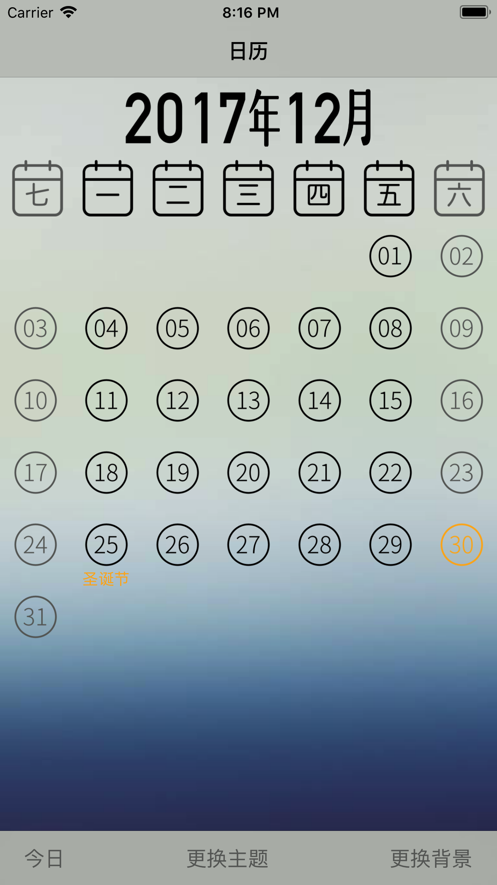
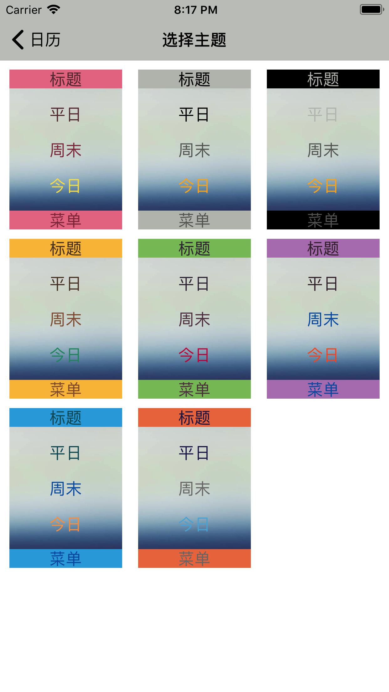
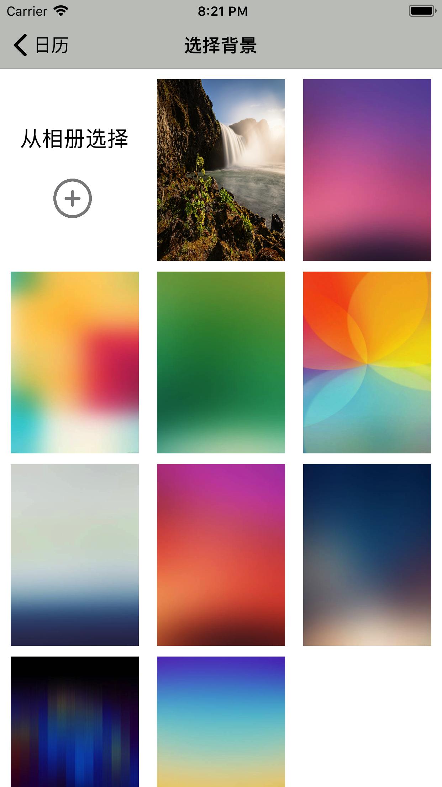
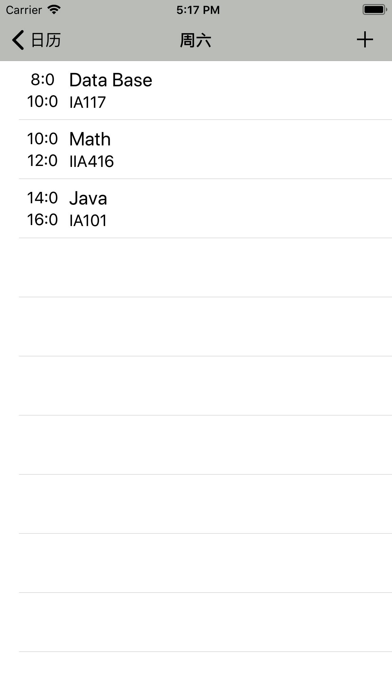
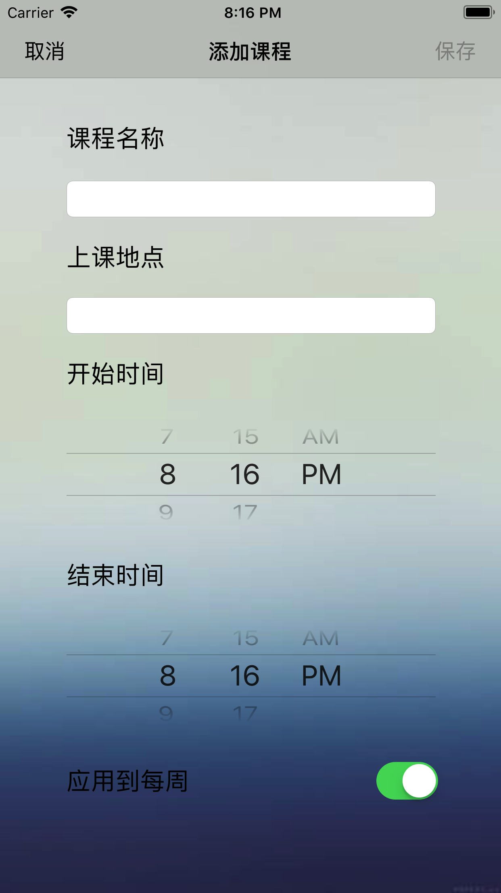
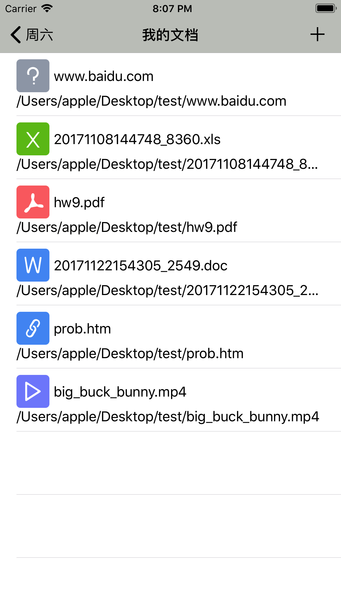
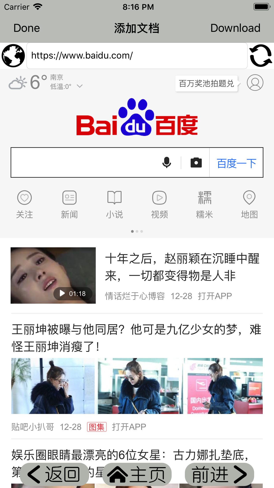
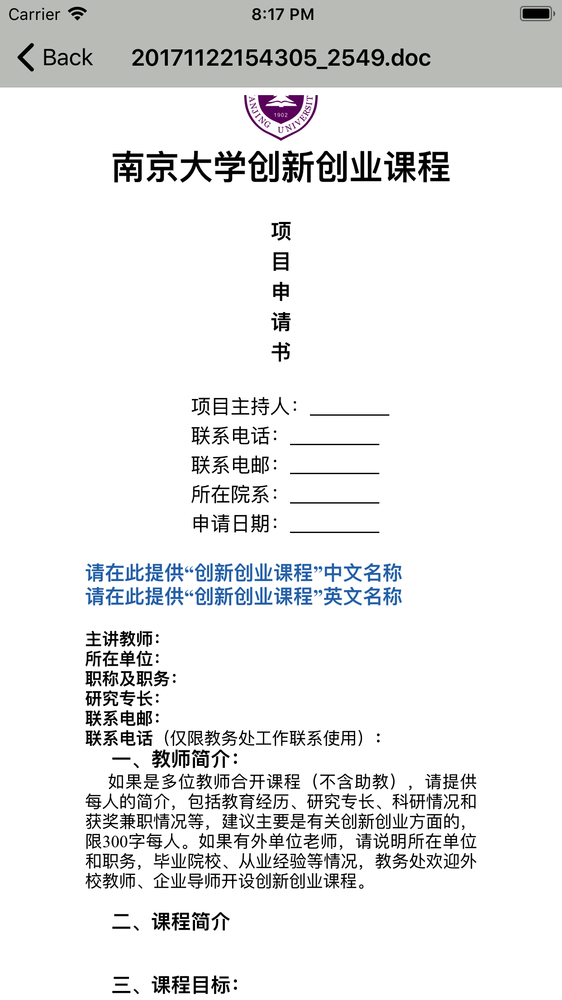

# Muti-calendar
### 移动互联应用开发

## 应用介绍
这是一款基于日历的课程软件，支持根据日历查看课程，下载相应文档及本地查看文档。

## 功能展示
### 一、日历显示
基础的日历显示

更换主题颜色

更换背景图片，支持从相册选择，长按删除

### 二、课程显示
使用TableView显示当日所有课程，按开始时间排序，滑动删除

添加课程

### 三、文档显示
该课程的所有文档列表，滑动删除

从网络上下载文档

查看本地文档

## 技术说明
### 一、日历显示
#### 基础的日历显示
日历采用CollectionView显示，共42个cell，在左右滑动翻页时通过实时计算当月的日历，并显示在cell中。点击某个日期进入当前日期的课程界面。

#### 更换主题颜色
主题颜色用CollectionView显示，当用户点击选择时，将选择结果储存在UserDefaults中，以实现持久存储，并能够在其他页面调用
对于不同的主题色，为了实现对颜色的方便存储与对图片的颜色变换，对UIColor类与UIImage类做了扩展，添加了从字符串生成颜色的方法，与对单色图片进行颜色替换的方法。

#### 更换背景图片，支持从相册选择
背景图片用CollectionView显示，当用户点击选择时，将选择结果储存在UserDefaults中，以实现持久存储。用户也能够从相册中添加图片到备选列表中，这些图片以CoreData储存。

### 二、课程显示
使用TableView显示当日所有课程，按开始时间排序
课程列表以TableView显示，所有课程储存在CoreData中，进入页面时通过对当前选择日期的判断从CoreData中读取显示。

### 添加课程
根据用户的输入向CoreData中存入课程数据

### 三、文档显示
该课程的所有文档列表
文档列表以TableView显示，文档名及位置信息储存在CoreData中，进入页面时通过对当前选择课程的判断从CoreData中读取显示。

### 从网络上下载文档
网页的浏览使用WKWebView控制，具有前进、后退、回到主页等简单功能。右上角的Download按钮可以下载当前的页面，当用户点击的链接为文件URL时会自动提示是否下载。下载功能使用URLSession的downloadTask完成，可以下载任意类型的数据。

### 查看本地文档
本地文档的打开使用了四种方式。
对于word，pdf，txt等文档，使用QuickLook进行查看；
对于视频音频使用AVPlayer打开播放；
对于zip压缩包，使用了开源库SSZipArchive解压到当前目录；
对于其他形式的文件，尝试使用WKWebView打开。
使用这四种方式基本可以打开日常学习中常见的文档。

## 结束语
此app基本实现了管理课程及文档的功能，在一定程度上方便了学习生活。但其仍存在许多缺陷，如界面不够美观，功能不够强大等，仍需要不断的完善。
如存在使用上，技术上或其他方面的问题，请及时与作者联系

#### 另 代码统计
所有由作者完成，不包括第三方库的.swift文件总行数：2606（不含空行）

